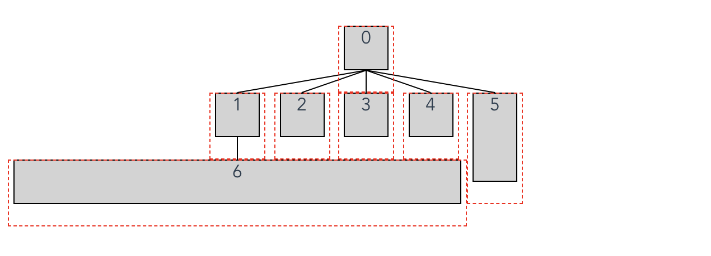

# non-layered-tidy-tree-layout

Draw non-layered tidy trees in linear time.

> This a JavaScript port from the project [cwi-swat/non-layered-tidy-trees](https://github.com/cwi-swat/non-layered-tidy-trees), which is written in Java. The algorithm used in that project is from the paper by _A.J. van der Ploeg_, [Drawing Non-layered Tidy Trees in Linear Time](http://oai.cwi.nl/oai/asset/21856/21856B.pdf). There is another JavaScript port from that project [d3-flextree](https://github.com/Klortho/d3-flextree), which depends on _d3-hierarchy_. This project is dependency free.

## Getting started
### Installation
```
npm install non-layered-tidy-tree-layout
```
Or
```
yarn add non-layered-tidy-tree-layout
```

There's also a built verison: `dist/non-layered-tidy-tree-layout.js` for use with browser `<script>` tag, or as a Javascript module.

### Usage
```js
import { BoundingBox, Layout } from 'non-layered-tidy-tree-layout'

const bb = new BoundingBox(gap=20, bottomPadding=40)
const layout = new Layout(bb)
const treeData = {
  id: 0,
  width: 40,
  height: 40,
  children: [
    {
        id: 1,
        width: 40,
        height: 40,
        children: [{ id: 6, width: 400, height: 40 }]
    },
    { id: 2, width: 40, height: 40 },
    { id: 3, width: 40, height: 40 },
    { id: 4, width: 40, height: 40 },
    { id: 5, width: 40, height: 80 }
  ]
}
treeData = layout.layoutTreeData(treeData)

// result treeData:
// {
//   id: 0,
//   x: 300,
//   y: 0,
//   width: 40,
//   height: 40,
//   children: [
//     {
//       id: 1,
//       x: 185,
//       y: 60,
//       width: 40,
//       height: 40,
//       children: [
//         { id: 6, x: 400, y: 120, width: 400, height: 40 }
//       ]
//     },
//     { id: 2, x: 242.5, y: 60, width: 40, height: 40 },
//     { id: 3, x: 300, y: 60, width: 40, height: 40 },
//     { id: 4, x: 357.5, y: 60, width: 40, height: 40 },
//     { id: 5, x: 415, y: 60, width: 40, height: 80 }
//   ]
// }
```
The method `Layout.layoutTreeData` modifies `treeData` inplace. It produces `(x, y)` coordinates to draw `treeData` like this:

 

The red dashed lines are the bounding boxes. `Layout.layoutTreeData()` produces coordinates to draw nodes, which are the grey boxes with black border.

The library also provides a class `Tree` and a method `layout`.

```js
/** 
 * Constructor for Tree.
 * @param {number} width - width of bounding box
 * @param {number} height - height of bounding box
 * @param {number} y - veritcal coordinate of bounding box
 * @param {array} children - a list of Tree instances
 */
new Tree(width, height, y, children)

/**
 * Calculate x, y coordindates and assign them to tree.
 * @param {Object} tree - a Tree object
 */
layout(tree)
```

In case your data structure are not the same as provided by the example above, you can refer to `src/helpers.js` to implement a `Layout` class that converts your data to a `Tree`, then call `layout` to calculate the coordinates for drawing.

## License
[MIT](./LICENSE)